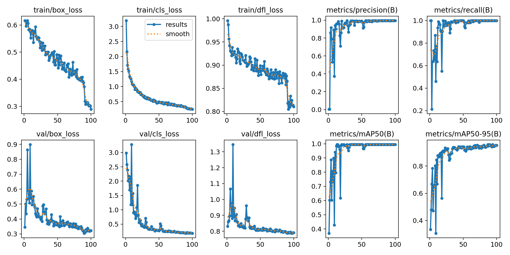

# Real-Time Bottle Defect Detection System

Automated visual inspection system for identifying defects in plastic bottles using YOLO-based computer vision.

## Overview

This system uses YOLOv8 object detection with BoT-SORT tracking to automatically detect, track, and classify defective bottles in real-time. Designed for quality control in manufacturing environments.


## Architecture

- **Tkinter GUI** (`app.py`) -- orchestrates detection thread, frame queue, and dashboard
- **Detection pipeline** (`backend/detector.py`) -- YOLO inference, BoT-SORT tracking, centerline counting, defect logging
- **Thread-safe database** (`backend/database.py`) -- dedicated worker thread wrapping SQLite (WAL mode)
- **Dashboard** (`frontend/dashboard.py`) -- live video feed, stats bar, failure log, export controls
- **CLI script** (`scripts/detect.py`) -- headless detection in an OpenCV window for quick testing

See `class_diagram.md` for full UML and threading diagrams.

## Training (image collection)

- images were collected by me and annotated in YOLO format
- dataset config: `dataset/data.yaml`
- classes are defined by the trained model and `dataset/data.yaml`
- trained on external Google Colab for GPU access

## Defect classes

- `good`
- `low_water`
- `no_cap`
- `no_label`

## Preliminary Results (Controlled Environment)

The custom YOLOv8n model achieves >99% mAP@0.5 on an 80/20 stratified train/val split. Dataset consists of ~300 images captured with varied camera angles, zoom levels, lighting, and positions. While these metrics demonstrate the model's capability to learn defect patterns, the small dataset size and single-environment capture may limit generalization.


*Training metrics over 100 epochs showing convergence*

**Important Limitations:**
- Small dataset size increases risk of overfitting
- Single capture environment may not generalize to diverse production settings
- Model performance on real-world manufacturing data remains to be validated

**WIP:**
- Expand dataset across multiple environments and bottle types
- K-fold cross-validation to better assess model robustness
- Add hard-negative examples to reduce false positives

## Setup

```bash
python -m venv venv
source venv/bin/activate
pip install -r requirements.txt
```

## How to run it

Tkinter GUI:

```bash
python app.py
```

CLI:

```bash
python scripts/detect.py --model my_model/train/weights/best.pt --source 0
```

## Data logging

Logging is automatic during detection:

- SQLite database: `database/defects.db`
- Defect image crops: `detections/`

Export to CSV:

```bash
python scripts/utils.py export
```

View statistics:

```bash
python scripts/utils.py stats
```

## Weights

- trained weights: `my_model/train/weights/best.pt` (and `last.pt`)
- additional weights: `my_model/my_model.pt`
