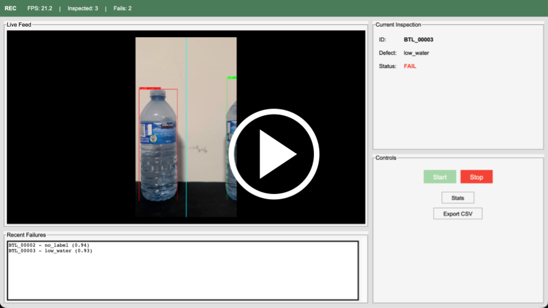
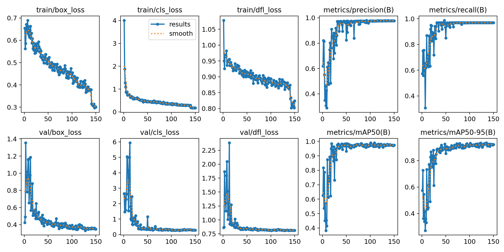

# Real-Time Bottle Defect Detection System

Automated visual inspection system for identifying defects in Kirkland plastic bottles using YOLO-based computer vision.

## Overview

This system uses YOLOv8 object detection and Bytetrack object tracking to automatically detect and classify defective bottles in real-time. Designed for quality control in manufacturing line environments.

[](https://www.youtube.com/watch?v=Nh-hHzurprs)
*Click to Watch Demo*


## Training (image collection)

- images were collected by me and annotated in YOLO format using Roboflow
- dataset config: `dataset/data.yaml`
- classes are defined by the trained model and `dataset/data.yaml`
- trained on external Google Colab for GPU access

## Defect classes

- `good`
- `low_water`
- `no_cap`
- `no_label`

## Preliminary Results (Controlled Environment)

The custom YOLO11s model achieves 97.7% mAP@0.5 (93.1% mAP@0.5-0.95) on an 80/20 stratified train/val split. Dataset consists of ~300 images captured with varied camera angles, zoom levels, lighting, and positions. While these metrics demonstrate the model's capability to learn defect patterns, the small dataset size and single-environment capture may limit generalization.

| Class | Precision | Recall | mAP@0.5 | mAP@0.5-0.95 |
|-------|-----------|--------|---------|--------------|
| all | 0.977 | 0.969 | 0.977 | 0.931 |
| good | 0.997 | 0.952 | 0.993 | 0.943 |
| low_water | 0.995 | 0.923 | 0.956 | 0.891 |
| no_cap | 0.996 | 1.000 | 0.995 | 0.967 |
| no_label | 0.918 | 1.000 | 0.963 | 0.925 |


*Training metrics over 150 epochs*

**Important Limitations:**
- Small dataset size increases risk of overfitting
- Single capture environment may not generalize to diverse production settings
- Model performance on real-world manufacturing data remains to be validated

**WIP:**
- Expand dataset across multiple environments and bottle types
- K-fold cross-validation to better assess model robustness

## Setup

```bash
python -m venv venv
source venv/bin/activate
pip install -r requirements.txt
```

## How to run it

Tkinter GUI:

```bash
python app.py
```

CLI:

```bash
python scripts/detect.py --model model/weights/best.pt --source 0
```

## How to log data

Logging is automatic:

- sqlite database: `database/defects.db`
- defect image crops: `detections/`

Export CSV:

```bash
python scripts/utils.py export
```

## Weights

- trained weights: `model/weights/best.pt` (and `last.pt`)
